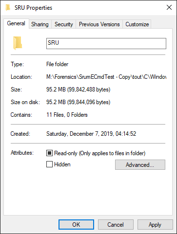
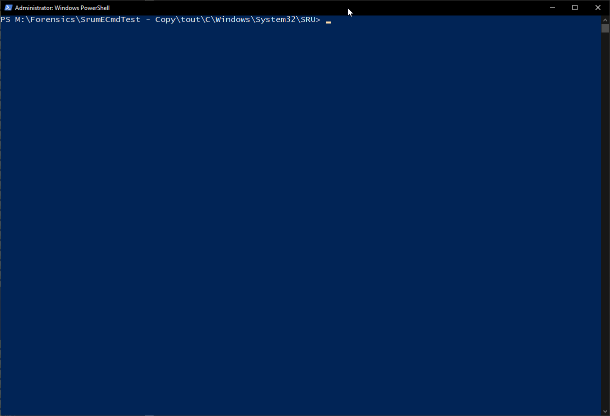
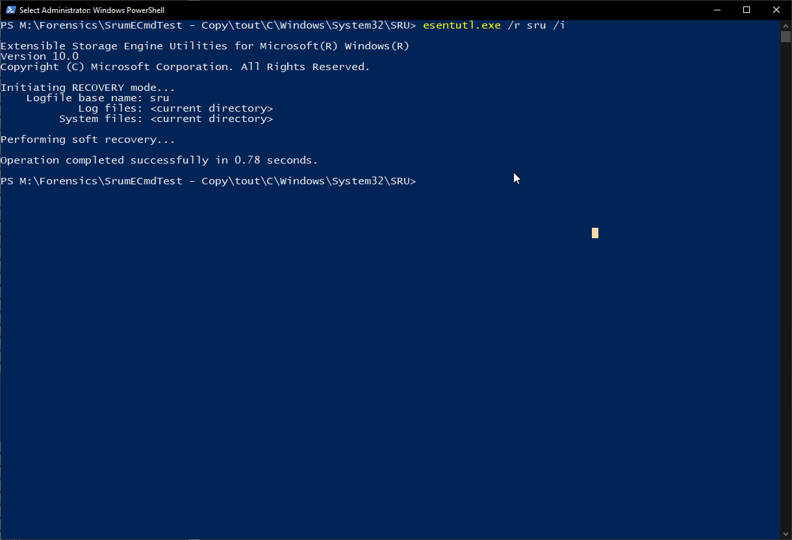

# SRUM parser

    SrumECmd version 0.5.0.1

    Author: Eric Zimmerman (saericzimmerman@gmail.com)
    https://github.com/EricZimmerman/Srum

            d               Directory to recursively process, looking for SRUDB.dat and SOFTWARE hive. This mode is primarily used with KAPE so both SRUDB.dat and SOFTWARE hive can be located
            f               SRUDB.dat file to process. Either this or -d is required
            r               SOFTWARE hive to process. This is optional, but recommended

            csv             Directory to save CSV formatted results to. Be sure to include the full path in double quotes

            dt              The custom date/time format to use when displaying time stamps. Default is: yyyy-MM-dd HH:mm:ss.fffffff

            debug           Show debug information during processing
            trace           Show trace information during processing

    Examples: SrumECmd.exe -f "C:\Temp\SRUDB.dat" -r "C:\Temp\SOFTWARE" --csv "C:\Temp\"
              SrumECmd.exe -f "C:\Temp\SRUDB.dat" --csv "c:\temp"
              SrumECmd.exe -d "C:\Temp" --csv "c:\temp"

              Short options (single letter) are prefixed with a single dash. Long commands are prefixed with two dashes

    Either -f or -d is required. Exiting

## Repairing the SRUDB.dat

When you run SrumECmd, you will likely encounter an error message that states the file is dirty. 

    Command line: -d M:\SrumECmdTest\tout -k --csv M:\Forensics\SrumECmdTest\mout\SystemActivity
    Found SRUM database file 'M:\Forensics\SrumECmdTest\tout\C\Windows\System32\SRU\SRUDB.dat'!
    Found SOFTWARE hive 'M:\Forensics\SrumECmdTest\tout\C\Windows\System32\config\software'!
    Processing 'M:\Forensics\SrumECmdTest\tout\C\Windows\System32\SRU\SRUDB.dat'...
    Error processing file! Message: Object reference not set to an instance of an object..
    This almost always means the database is dirty and must be repaired. This can be verified by running 'esentutl.exe /mh SRUDB.dat' and examining the 'State' property
    If the database is dirty, **make a copy of your files**, ensure all files in the directory are not Read-only, open a PowerShell session as an admin, and repair by using the following commands (change directories to the location of SRUDB.dat first):
    'esentutl.exe /r sru /i'
    'esentutl.exe /p SRUDB.dat'
    Executed 1 processor in 0.9046 seconds

    Total execution time: 6.5490 seconds
    
Follow these steps to repair the SRUDB.dat so you can run SrumECmd.exe again. First, follow the steps SrumECmd provides:
1. Make a copy of the files within the .\SRU directory
2. Ensure the .\SRU directory itself is not Read Only. This can be done by right clicking on the directory itself, Properties, and unchecking Read Only if it is checked

3. Open a PowerShell session as an Administrator in the directory where your copied files reside
4. Execute this command within the PowerShell Admin session: 
    esentutl.exe /r sru /i

5. Execute this command within the PowerShell Admin session: 
    esentutl.exe /p SRUDB.dat

6. Try running SrumECmd again against the location where these repaired files reside
